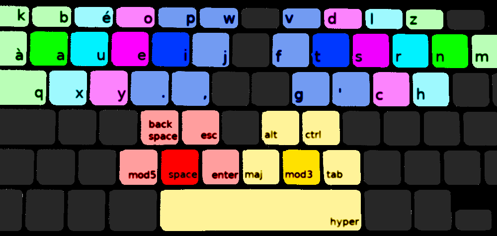
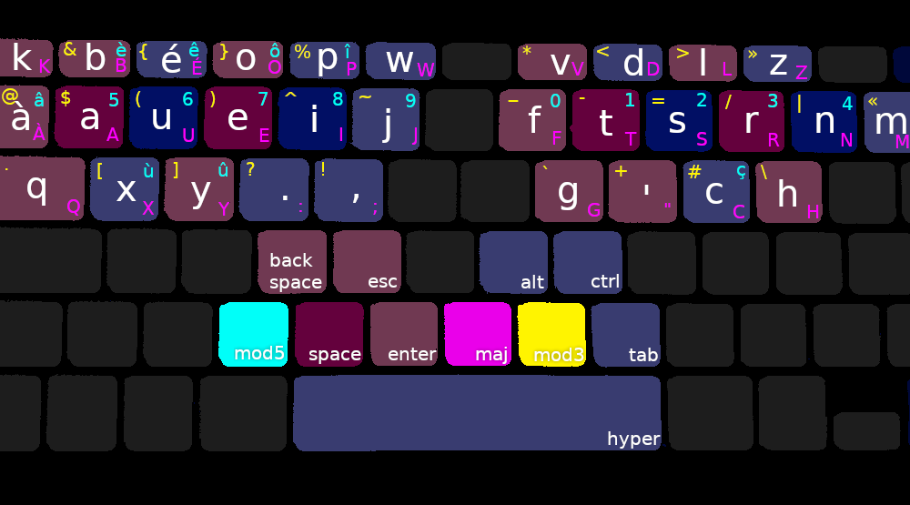
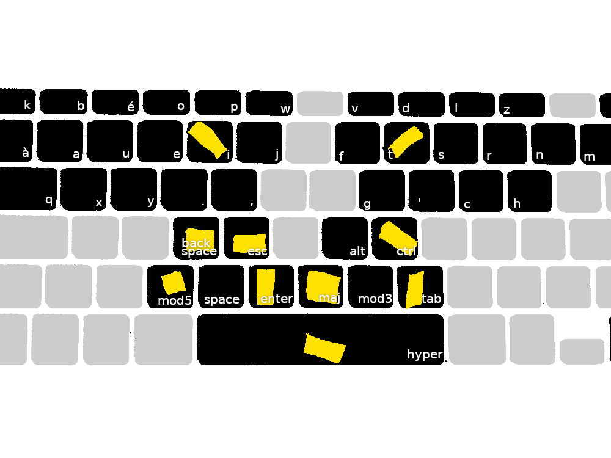

qxy.,
=====

fichiers de configuration [X11](https://www.x.org/releases/X11R7.5/doc/input/XKB-Config.html) pour une disposition de clavier [BÉPO](https://bepo.fr/wiki/Accueil) réarrangée.





pourquoi
--------

mes petits auriculaires étaient fatigués d'utiliser `Enter`, `Shift`, `Ctrl`, `Tab`. et mes pouces étaient peu solicité, se partageant à deux une seule touche gigantesque (la barre d'espace). 

donc j'ai tout monté de deux rangées: les signes `béop` se trouvent sous les touches `F1`, `F2` (etc.) et les signes `qxy.,` remplacent `qwertz`.

principes:

- accès facilité avec les pouces aux touches modificatrices (ex. `Shift`) et aux 'touches-actions' (ex. `Escape`, `Enter`), 
- accès facilité et arrangement logique des signes de ponctuation courants en français (`.,'-/:;()`, etc.) et en programmations (`^$[]{}|\`, etc.);
- utiliser le plus possible les pouces;
- utiliser le moins possible les auriculaires;

installation
============

ajouter le contenu du fichier `qxy-point-virgule` au fichier `xkb-fr` (ou à un autre), par exemple avec cette commande:

```bash
sudo tee -a /usr/share/XTT/xkb/symbols/fr < ./qxy-point-virgule
```

debian + macbook
------------

pour pouvoir rebind les touches fonctions sur un macbook, le fichier `/etc/modprobe.d/hid_apple.conf` peut devoir être modifié (ou créé) de façon à contenir la ligne suivante: 

```modconf
options hid_apple fnmode=2
```

ensuite lancer ces deux commandes (et redémarrer l'ordinateur):

```bash
sudo modprobe --dry-run hid_apple 
sudo update-initramfs -u 
```

hardware
--------

pour rendre ce layout vraiment utilisable, j'ai du arrangé un peu mon clavier, j'ai mis des espèces de petits tas de scotch sur certaines touches (en jaune ci-dessous):


